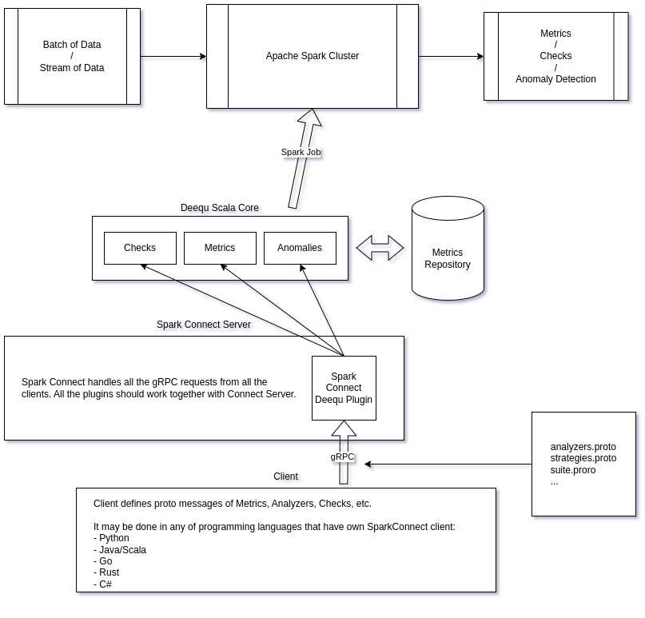

# Tsumugi Spark

**_UNDER ACTIVE DEVELOPMENT_**

[](https://github.com/SemyonSinchenko/tsumugi-spark/actions/workflows/ci.yml)

[Documentation](https://semyonsinchenko.github.io/tsumugi-spark/)

<p align="center">
  
</p>

**_NOTE:_** _Tsumugi Shiraui is a chimera: a hybrid of Human and Gauna. She combines the chaotic power of Gauna with a Human intillegence and empathia. Like an original character of the Manga "Knights of Sidonia", this project aims to make a hybrid of very powerful but hard to learn and use Deequ Scala Library with a usability and simplicity of Spark Connect (PySpark Connect, Spark Connect Go, Spark Connect Rust, etc.)._


## About

The project's goal is to create a modern, SparkConnect-native wrapper for the elegant and high-performance Data Quality library, [AWS Deequ](https://github.com/awslabs/deequ). The PySpark Connect API is expected to be the primary focus, but the PySpark Classic API will also be maintained. Additionally, other thin clients such as `connect-go` or `connect-rs` will be supported.

## Why another wrapper?

While Amazon Deequ itself is well-maintained, the existing PyDeequ wrapper faces two main challenges:

1. It relies on direct `py4j` calls to the underlying Deequ Scala library. This approach presents two issues:
   a) It cannot be used in any SparkConnect environment.
   b) `py4j` is not well-suited for working with Scala code. For example, try creating an `Option[Long]` from Python using `py4j` to understand the complexity involved.
2. It suffers from a lack of maintenance, likely due to the issues mentioned in point 1. This can be seen in [this GitHub issue](https://github.com/awslabs/python-deequ/issues/192).
3. The current python-deequ implementation makes it impossible to call row-level results because `py4j.reflection.PythonProxyHandler` is not serializable. This problem is documented in [this GitHub issue](https://github.com/awslabs/python-deequ/issues/234).

### Goals of the project

- Maintain `proto3` definitions of basic Deequ Scala structures (such as `Check`, `Analyzer`, `AnomalyDetectionStrategy`, `VerificationSuite`, `Constraint`, etc.);
- Maintain a Scala SparkConnect Plugin that enables working with Deequ from any client;
- Maintain a Python client that provides a user-friendly API on top of classes generated by `protoc`;
- Provide utils to enhance Deequ's server-side functionality by adding more syntactic sugar, while ensuring their maintenance remains on the client-side.

### Non-goals of the project

- Creating a replacement for Deequ is not the goal of this project. Similarly, forking the entire project is not intended. Deequ's core is well-maintained, and there are no compelling reasons to create an aggressive fork of it.
- Developing a low-code or zero-code Data Quality tool with YAML file configuration is not the project's objective. Currently, the focus is on providing a well-maintained and documented client API that can be used to create low-code tooling.

### Architecture overview

From a high-level perspective, Tsumugi implements three main components:

1. Messages for Deequ Core's main data structures
2. SparkConnect Plugin and utilities
3. PySpark Connect and PySpark Classic thin client

The diagram below provides an overview of this concept:



## Project structure

### Protobuf messages

The `tsumugi-server/src/main/protobuf/` directory contains messages that define the main structures of the Deequ Scala library:

- `VerificationSuite`: This is the top-level Deequ object. For more details, refer to `suite.proto`.
- `Analyzer`: This object is defined using `oneof` from a list of analyzers (including `CountDistinct`, `Size`, `Compliance`, etc.). For implementation details, see `analyzers.proto`.
- `AnomalyDetection` and its associated strategies. For more information, consult `strategies.proto`.
- `Check`: This is defined using `Constraint`, `CheckLevel`, and a description.
- `Constraint`: This is defined as an Analyzer (which computes a metric), a reference value, and a comparison sign.

### SparkConnect Plugin

The file `tsumugi-server/src/main/scala/org/apache/spark/sql/tsumugi/DeequConnectPlugin.scala` contains the plugin code itself. It is designed to be very simple, consisting of approximately 50 lines of code. The plugin's functionality is straightforward: it checks if the message is a `VerificationSuite`, passes it into `DeequSuiteBuilder`, and then packages the result back into a `Relation`.

### Deequ Suite Builder

The file `tsumugi-server/src/main/scala/com/ssinchenko/tsumugi/DeequSuiteBuilder.scala` contains code that creates Deequ objects from protobuf messages. It maps enums and constants to their corresponding Deequ counterparts, and generates `com.amazon.deequ` objects from the respective protobuf messages. The code ultimately returns a ready-to-use Deequ top-level structure.


## Getting Started

At the moment there are no package distributions of the server part as well there is no pre-built PyPi packages for clients. The only way to play with the project at the moment is to build it from the source code.

### Quick start

There is a simple Python script that performs the following tasks:

1. Builds the server plugin;
2. Downloads the required Spark version and all missing JAR files;
3. Combines everything together;
4. Runs the local Spark Connect Server with the Tsumugi plugin.

```sh
python dev/run-connect.py
```

Building the server component requires Maven and Java 11. You can find installation instructions for both in their official documentation: [Maven](https://maven.apache.org/install.html) and [Java 11](https://openjdk.org/install/). This script also requires Python 3.10 or higher. After installation, you can connect to the server and test it by creating a Python virtual environment. This process requires the `poetry` build tool. You can find instructions on how to install Poetry on their [official website](https://python-poetry.org/docs/#installation).

```sh
cd tsumugi-python
poetry env use python3.10 # any version bigger than 3.10 should work
poetry install --with dev # that install tsumugi as well as jupyter notebooks and pyspark[connect]
```

Now you can run jupyter and try the example notebook (`tsumugi-python/examples/basic_example.ipynb`): [Notebook](https://github.com/SemyonSinchenko/tsumugi-spark/blob/main/tsumugi-python/examples/basic_example.ipynb)

### Server

Building the server part requires Maven.

```sh
cd tsumugi-server
mvn clean package
```

### Client

Installing the PySpark client requires `poetry`.

```sh
cd tsumugi-python
poetry env use python3.10 # 3.10+
poetry install
```

## References

Tsumugi is built on top of Deequ Data Quality tool:

- _Schelter, Sebastian, et al. "Automating large-scale data quality verification." Proceedings of the VLDB Endowment 11.12 (2018): 1781-1794._, [link](https://www.amazon.science/publications/automating-large-scale-data-quality-verification?ref=https://githubhelp.com)
- _Schelter, Sebastian, et al. "Unit testing data with deequ." Proceedings of the 2019 International Conference on Management of Data. 2019._, [link](https://www.amazon.science/publications/unit-testing-data-with-deequ)
- _Schelter, Sebastian, et al. "Deequ-data quality validation for machine learning pipelines." (2018)._, [link](https://www.amazon.science/publications/deequ-data-quality-validation-for-machine-learning-pipelines)
